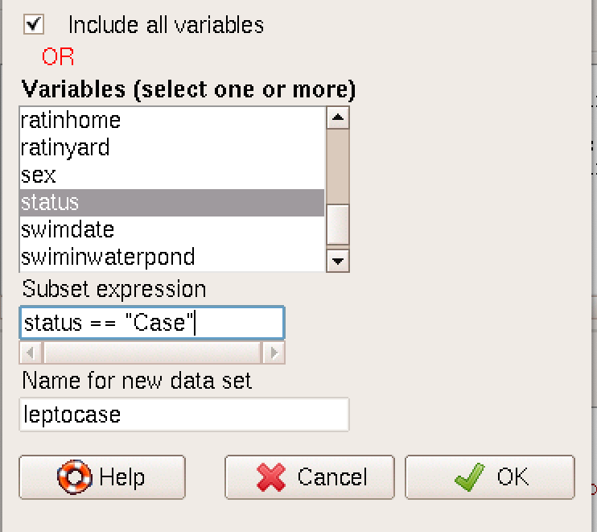

\newpage

# Install and load packages in R.

## To conduct this excercise in R you need to install the following packages:

-   "tidyverse"
-   "knitr",
-   "readxl",
-   "lubridate",
-   "gtsummary",
-   "flextable"

### Install the required packages, general reccomendations

Packages are installed only once in R, but you need to loed them every
time you start new session in R.

**To install package using RStudio you need to use following menu.**

-   To install package you should write the package name in quotation
    marks (' ' or " "), in parenthesis in the *install.packages()*
    function.

-   Make sure the function includes the statement *dependencies=TRUE*.

-   Here is the example of code to install *tidyverse* package:
    *install.packages('gtsummary', dependencies=TRUE)*.

-   This is the way you install packages one by one.

-   After installation packages you need to load them using *library()*
    function.

-   You should pass the name on package between parenthesis.

-   Your code to load package *tidyverse* will look like
    *library(tidyverse)*

### Use this code to install and load the required packages simultaneously

```{r installandloadlibraryes, include = params$ftr, warnings=params$warnftr, echo= params$echoftr, message = params$msg}
knitr::opts_chunk$set(comment=NA, prompt=TRUE, out.width=1050, fig.height=8, fig.width=8)
## istall and load packages that needed
ipak <- function(pkg){
  new.pkg <- pkg[!(pkg %in% installed.packages()[, "Package"])]
  if (length(new.pkg))
    install.packages(new.pkg, dependencies = TRUE)
  sapply(pkg, require, character.only = TRUE)
}
# indicaete package names
packages <- c("tidyverse", "dplyr","readxl","lubridate","gtsummary",  "knitr", "Rcmdr", "flextable", "cardx")

# use created function ipak and pass packages you wont to install and load
ipak(packages)

```

# Introduction

## Learning Objectives

After completing this exercise, the student should be able to:

-   List the components of descriptive epidemiology.
-   Given data from a surveillance system or field investigation, use
    descriptive statistics, tables. graphs, and maps to summarize the
    descriptive epidemiology.
-   Apply computer programs (R and its libraries, including R Commander)
    to compile the raw data into summary tables, graphs.
-   Identify and interpret patterns in the summary statistics, tables
    and graphs.
-   Compile descriptive epidemiologic findings into a working
    hypothesis.
-   Develop a One Health approach for further investigation of this
    outbreak.

## Leptospirosis as a disease

Leptospirosis is a zoonotic disease with epidemic potential, especially
after a heavy rainfall, caused by a bacterium called Leptospira.
Leptospirosis is caused by any of 10 pathogenic spirochete species of
the genus Leptospira. Clinical leptospirosis disease in humans features
high fever, severe headache, chills, and muscle aches. Less frequent
features may include jaundice (yellow skin and eyes), red eyes,
abdominal pain, diarrhea, or a rash. In some cases, infections may occur
without symptoms. The diagnosis should be confirmed with laboratory
testing of blood or urine. Two reliable serologic tests are available to
diagnose Leptospirosis: 1) the microagglutination test (MAT) and 2) the
IgM ELISA tests. These become positive 1 to 2 weeks after onset of
symptoms. Early diagnosis can be made using darkfield microscopy of
fresh blood to visualize the active leptospiral spirochetes, but this
requires a well-practiced microscopist. Culture requires specialized
media and needs 3 months to complete. For details of other confirmatory
tests see the accompanying reference.

Leptospirosis is a zoonosis affecting over 160 mammalian species.
Leptospires have been found in domestic livestock (cattle, pigs, horses,
sheep, goats, and dogs), pests (rats, mice, and other rodents), and many
wild mammals. Leptospira species have many serovars which are adapted to
specific non-human mammals. Mammals infected with an adapted strain
maintain the infection for months or years without disease while
excreting leptospires in their urine. Hence, these mammals are
considered to be maintenance or reservoir hosts. Humans are exclusively
accidental hosts. Excretion from the urine usually ceases within two
weeks after the acute disease ends. The infection is not spread from
person-to-person except in a few rare incidents.

Humans become infected through direct contact with infected mammals or
through water, food, or soil (usually muddy or wet) containing urine
from infected mammals. Exposure may happen from swallowing contaminated
water or food or through contact of broken skin or mucosal surfaces with
water or soil. Outbreaks and seasonal increases typically follow heavy
rains that wash contaminated soil or water into streams, ponds, and
other collections of surface water. Pathogenic leptospires do not
multiply in water but can survive for months in aquatic environments.
The incubation period between a person's exposure to a contaminated
source and becoming sick is usually from 5 to 14 days (average 9-10
days). Rarely, the onset of infection may occur from 2 days to 4 weeks
after exposure.

## Outbreak of Leptospirosis in Kenkolat village in East Kazakhstan

An outbreak of suspected leptospirosis occurred in Kenkolat village in
East Kazakhstan, during August 2004. Kenkolat had a population of 319
people living in approximately 70 houses. Villagers raised livestock,
particularly cattle (bovines). Kenkolat lay alongside a permanent stream
in hilly steppe land. The climate classification is Dfb (Humid
continental, no dry season, with warm summers). Monthly rainfall for the
area averages 52 mm in July, 30 mm in August and 540 mm annually. The
mean daily temperature is 25$^\circ$C in July and 23$^\circ$C in August.

An epidemiologic team travelled to Kenkolat from August 23 to 27, 2004.
The outbreak investigation team collected clinical and epidemiological
data from leptospirosis cases reported from the local public health
authorities.

**Question 1.** List the variables you will require to measure the
values of descriptive epidemiology of this outbreak?

**Answer 1.** Descriptive epidemiology should include information on the
disease (clinical features), time, place, and person. Variables to
assess might include:

```{r h, include = FALSE}
cnl <- c("Disease", "Time", "Place", "Person")
row1 <- c("Fever", "Onset", "Home", "Age")
row2 <- c("Headache", "Hospitalization", "Workplace or school", "Sex")
row3 <- c("Chills", "Death", "Possible sources", "Occupation")
row4 <- c("Muscle aches", "Possible causative factors", "",
          "Contact with mammals")
row5 <- c("Vomiting", "Possible controlling factors", "",  "")
row6 <-  c("Diarrhea", "", "", "")
row7 <- c("Jaundice", "", "", "")
row8 <- c("Red eyes", "", "", "")
row9 <- c("Rash", "", "", "")
row10 <- c("Lab tests including confirmation", "", "", "")

vbnames <-  rbind(row1, row2, row3, row4, row5, row6, row7,
                             row8, row9, row10)

vbnames <- as.data.frame(vbnames)

colnames(vbnames) <- cnl

```

```{r, echo=FALSE}

kable(vbnames, row.names = F, caption = "Table 1. List of variables for Leptospirosis outbreak.")
```

# Data management steps.

## Import data into R.

**Using Rcmdr point-and-click:**

<mark> Data -\> Import data -\> From text file… </mark>


And the dialog box opens.

In the dialogue window that opens:

-   Enter name for dataset: leptodb
-   Convert character variables to factors: Uncheck
-   Missing: NA
-   Field separator: Select commas [,]
-   Decimal-point character: [.]
-   Click OK


**Import data using R code.**

```{r importdatalepto, echo = params$echoftr}
## Import data from excel file.
df <- read_xlsx("../data/LeptospDBclean.xlsx",  sheet = "LeptoDB", na = "NA")  
```

### check the names of variables in your file.

**Using Rcmdr point-and-click:**

<mark> Data -\> Active datasets -\> Variables in active dataset </mark>


**Using R code :**

```{r}
## select all necessary variables from dataset
names(df) 
```

### Delete variables form dataset

-   In R commander you should use following menu:

<mark> Data -\> Manage variables in active dataset -\> Delete variables
in active dataset </mark>

 - Then you need to select variable names
in the window to delete - Click Ok - Your selected variables are
deleted.


-   Delete variables code in R:

```{r}
leptodbfinal <- df %>% 
  select(-c(calfmusc, eyered, lappet, mregdt, liveren, livrtnd, mcpbldlp))
```

### View the summary of your dataset?

<mark> Statistics -\> Summaries -\> Active dataset </mark>


```{r}
##  see the summary statistics of dataset 
summary(leptodbfinal)
```

### Count missing observations


```{r}
# check numver of missing values in for each variables
colSums(is.na(leptodbfinal))
```

### Recode variables with missing values (NA) to 0:

<mark> Data -\> Manage variables in active dataset -\> Recode variables
</mark>


- in the recode variables window add appropirate 


```{r}
## replace all NA values to 0
leptodbfinal <- leptodbfinal %>% 
  mutate_if(is.numeric, ~replace_na(., 0)) 
## glimpse and summary
glimpse(leptodbfinal)
summary(leptodbfinal)
```

### Recode variables from numeric to factor:

<mark> Data -\> Manage variables in active dataset -\> Convert numeric
variables to factors </mark>

 


- In the dialogue window that opens up,
select the above variables (hold the “shift” button to select more than
one).

-   Check that the factor level is set to “use names”.

-   Click OK

```{r}
leptodbfinal <- leptodbfinal %>% 
  mutate_if(is.numeric, as.factor)
```

### Convert variable to date

Some variables in the dataset are shown as character but they are
actually date variables.

This is the case for variables “dateonset”, “datediagnosis”

Using Rcmdr point-and-click:

<mark> Data -\> Manage variables in active dataset -\> Compute new
variable </mark>


-When you clikc it the new dialogue window pops up

-Type the new variable name: new_datediagnosis

-In expression to compute type: as.Date(datediagnosis)

-Click OK

You have now created a new date type variable called “new_datediagnosis”

You can repeat this same step to create the date variable
“new_dateonset” from variable "dateofsymptoms"


```{r}
leptodbfinal <- leptodbfinal %>% 
  mutate(new_datediagnosis = as.Date(datediagnosis),
         new_dateonset = as.Date(dateofsymptoms))
```

### Calculate difference between two dates

-   We should calculate difference between date of diagnosis and date of
    onset to detect the delay between diagnosis and onset of disease.
-   In R commander we need to got to following menu:

<mark>Data -\> Manage variables in active dataset -\> Compute new
variable</mark>


-   In the new variable calcuation window we need to write formula to
    calculate difference

 

- R code to calculate difference
between two dates. - Use function **difftime** to calculate difference
of **days** between two dates. - Date should be in **ISO** or **Date**
format to calculate using **difftime**.

```{r}
# calcualate differnce between date of onset and date of diagnosis
leptodbfinal <- leptodbfinal %>% 
  mutate(new_diffdate = difftime(new_datediagnosis, new_dateonset, units = "days"),
         new_diffdatenm = as.numeric(new_diffdate))
# check recoded variables
head(leptodbfinal[,c("new_datediagnosis", "new_dateonset","new_diffdate", "new_diffdatenm")])
```

### Create new categorical variable from numeric variable by recoding it.

Using Rcmdr point-and-click:

Data -\> Manage variables in active dataset -\> Recode variables


-   New window appears and you should select variable age
-   Type the new variable name: new_age
-   Select checkbox for make new variable a factor
-   In recode directives:

**`10:39=1 40:70`**

-   Click OK
-   You have now created a new numeric variable called “new_age”


```{r}
leptodbfinal <- leptodbfinal %>% 
# calculate age variabel from date of birth variable (DOB)
    mutate(age = as.numeric(2004 - year(dob)),
  agegr = cut(age, breaks = c(9,39,70), labels = c("10-39",  "40-70")))
```

## Refresh active dataset

In Rcmdr after you create new variables you need to refresh.

Using Rcmdr point-and-click:

<mark> Data -\> Active dataset -\> Refresh active dataset </mark>


**This is only for R commander, RStudio does not require to refresh
active dataset.**

## Save and export data into csv format

For R Commander:

<mark>Data -\> Active dataset -\> Export active dataset</mark>

 -- Open the window and indicate several
paramaters: - In the dialogue window that opens up, uncheck write wrote
names - Type in missing value: NA - Select field separator commas[,] -
In the next dialogue window that opens up, type in the new file name
“Lpetospirosis_clean.txt” - Click OK


```{r writetable}
## export data into csv
write.table(leptodbfinal, "../output/leptospirosis_clean.csv", sep=",", col.names=TRUE, row.names=FALSE, quote=TRUE, na="NA")
```

## Subset data for Cases only

-   Name your new data file as **Leptospcasen**



-   Subset **Leptospcasen** using RStudio.

```{r recodetocategorical, echo = params$echoftr}
## Select only confirmed cases.
Leptospcasen <- leptodbfinal %>% filter(status == "Case") 
```

# Leptospirosis data analysis.

## N of cases

-   In R commander.
-   Activate **Leptospcasen** dataset.
-   Open **Compute new variable** window to count N of cases in the
    dataset.

<mark>Data -\> Manage variables in active dataset -\> Compute new
variable</mark>


-   In the window **Expression to compute** write code **NROW(id)**


```{r Nofcases}
## calcualte N of cases 
nlpcs <- NROW(Leptospcasen$id)
```

## Univariate data analysis

### Continious data analysis of numeric variables

-   Do summaries of the numeric variables for age, new_datediff
-   Using Rcmdr point-and-click:

<mark> Statistics -\> Summaries -\> Numerical summaries </mark>


-   In the dialogue window that opens up, select all variables you want
    to summarize.


-   Click on the statistics tab and ensure that Mean, Standard
    Deviation, and Quantiles are checked.


-   Calculate summary statistics of numeric variables "age",
    "new_diffdatenm" in RStudio.

```{r}
numSummary(leptodbfinal[,c("age", "new_diffdatenm"), drop=FALSE], statistics=c("mean", "sd", "quantiles"), quantiles=c(0,.25,.5,.75,1))
```

### Univariable summaries of categorical variables

-   Create summaries of the categorical variables for symptom variables:
    diarrhea, fever, illness, outcome, pain, vomit

-   Using Rcmdr menu:

<mark> Statistics -\> Summaries -\> Frequency distributions </mark>


-   Select variables for frequency distribution.


-   Categorical data analysis using RStudio.

```{r}
## count categories headache
table(leptodbfinal$headache)
## count proportions of headache
round(prop.table(table(leptodbfinal$headache)),2)
```

-   Repeat same for all variables you need to analize.

## Bivariable analysis - t-test

-   Create summaries of the numerical variables by category, for
    example, age by case_status

-   Using Rcmdr menu:

<mark> Statistics -\> Means -\> Independent samples t-test </mark>


-   In the dialogue window that opens up, select the groups variable:
    status
-   Select in the response variable: age

 - Calculate age difference usig ttest

```{r}
t.test(age ~ status, data = leptodbfinal)
```

## Bivariable analysis - chi-square

-   Create summaries of the categorical variables by category, for
    example, agegr by status

-   Using Rcmdr point-and-click:

<mark> Statistics -\> Proportions -\> Two-sample proportions test
</mark>


-   In the dialogue window that opens up, select the groups variable:
    agegr

-   Select in the response variable: status


-   Use RStudio to calculate data.

```{r}
chiqtbl <- xtabs(~ agegr + status, data = leptodbfinal)
chiqtbl
chisq.test(chiqtbl)
```

## Bivariable analysis - odds ratio

-   Recode variable **status** into **statusn** and make **Case = 1**
    and **Control = 0**, this is necesary to fit models and calcualate
    **Odds Ratio**.

-   Conduct this in R Commander.


-   In the recode window we need to enter code to recode cases and
    controls


-   Recoding in RStudio.

```{r}
leptodbfinal$statusn <- ifelse(leptodbfinal$status == "Case", 1, 0)
```

-   Using Rcmdr menu:

<mark> Statistics -\> Fit models -\> Generalized linear models </mark>


-   In the left side of the model insert: status

-   Select in the response variable: new_cookedchicken

-   Ensure that binomial and logit are selected


-   Resutls


-   Next get confidence intervals for our outputs


-   In the window you should select


-   You get results:


```{r}
## Calculate OR using, create model
GLMOR <- glm(statusn ~ owndesheep, family=binomial(logit), data=leptodbfinal)
## Calculate summary of OR
summary(GLMOR)
```

```{r}
## Exponentiated coefficients
exp(coef(GLMOR))
```

```{r}
## Calcualte confidence intervals
Confint(GLMOR, level=0.95, type="LR", exponentiate=TRUE)
```

# Descriptive analysis and distribution of symptoms of Leptospirosis in the outbreak data.

-   Codes for R to create complex nice looking tables using
    **GTsummary** package.

```{r tables, echo = params$echoftr}

#table for gender by age years
leptb1 <- Leptospcasen %>% 
  select(c(sex, age)) %>% 
 tbl_summary(by = sex,
              percent = "column",
              sort = all_categorical() ~ "frequency",
              statistic = list(
                all_continuous() ~ "{mean} ({sd})",
                all_categorical() ~ "{n} ({p})"
              ),
             
              missing_text = "Unk.")%>%
  modify_header(label = "**Gender and age(years)**") %>% 
  bold_labels() 
# add_p(test = list(all_categorical() ~ "chisq.test")) %>%
# bold_p(t = .05)
leptb1 <- as_flex_table(leptb1)

#table for sex and by agegroups
leptb2 <- Leptospcasen %>% 
  select(c(sex, agegr)) %>% 
 tbl_summary(by = sex,
              percent = "column",
              #sort = all_categorical() ~ "frequency",
              statistic = list(
                all_continuous() ~ "{mean} ({sd})",
                all_categorical() ~ "{n} ({p})"
              ),
             
              missing_text = "Unk.")%>%
  modify_header(label = "**Gender and age(years)**") %>% 
  bold_labels() 
leptb2 <- as_flex_table(leptb2)


leptb3 <- Leptospcasen %>% 
  select(c(headache, fever, chils, myalgia)) %>% 
  mutate(headache = fct_recode(headache, "SEVERE" = "1", "INTERMED" = "2", "MILD" = "3", "NO PAIN" = "4", "NA" = "0"), fevern = as.numeric(fever)) %>% 
 tbl_summary(#by = admy,
              percent = "column",
              sort = all_categorical() ~ "frequency",
              statistic = list(
                all_continuous() ~ "{mean} ({sd})",
                all_categorical() ~ "{n} ({p})"
              ),
              missing_text = "Unk.") %>%
  modify_header(label = "**Symptoms of Leptospirosis**") %>% 
  bold_labels() 
leptb3 <- as_flex_table(leptb3)
```

**Task 2.2** Demographic characteristics of cases by gender and age. Are
there more males or females affected? Create frequency distribution of N
of cases by gender and detect mean values and standard deviation of age?
Calculate mean age and standard deviation by gender?.

**Answer 2.2** Frequency distribution of cases by gender and age are
provided in the Table 2.

**Table 2.** Cases of Leptospirosis by age and by gender. `r leptb1`

**Table 3.** Cases of Leptospirosis by age groups and by gender.
`r leptb2`

**Task 2.3** Create a table that summarizes the clinical features of the
`r nlpcs` cases. What does the distribution suggest to you?

**Answer 2.3** Frequency distribution of symptoms are provided in the
Table 2.

**Table 4.** Distribution of leptospurosis symptoms among case patients.
Clinical Features of case Patients with Leptospirosis, Kenkolat, East
Kazakhstan, August 2004. `r leptb3`

**Task 3.1** Create distribution of cases by date of onset of symptoms.
Create Epi courve in R using histogram?

**Instructor’s Note:** Interval on X-axis should maximize the clarity of
the pattern while preserving important detail. One general guideline is
to use ¼ of the average incubation period for the interval. The average
incubation period of leptospirosis is 10 days. One fourth of 10 days is
2.5. So, ask the class to use 2 graphs: one with 1-day intervals (for
detail), and the other with 3-day intervals (for a general pattern).

**Answer 3.1** Leptospirosis by date of onset of symptoms, Kenkolat,
Kazakhstan, July-August 2004.

**Table 5.** Epi curve of cases of Leptospirosis by date of onset of
symptoms during outbreak of Kenkolat, Kazakhstan, July-August 2004.
(Interval 1 day).

# Create plots/Histogram **Epicurve** in R commaneder and R using **ggplot** packages

-   Create histogram using R commander


-   Select **dateofsymptoms** variable to create histogram


-   Create histogram in R Commander.


-   Create histogram using R code.

```{r plot2, echo = params$echoftr, warning=params$warnftr, out.width = '100%'}
plot2 <- Leptospcasen %>% 
ggplot(aes(x = as.Date(dateofsymptoms))) + 
  theme_bw() +  
  stat_bin(binwidth=1, fill = "red") +
  labs(x="Date of onset", y="Leptospyrosis cases") + 
  theme(axis.text.x=element_text(angle=60, hjust=1)) +
  scale_x_date(date_breaks = "days", date_labels = "%d-%m-%y", 
  limits=c(ymd("2004-07-20"), ymd("2004-08-30")))
plot2
```

**Table 6.** Epi curve of cases of Leptospirosis by date of onset of
symptoms during outbreak of Kenkolat, Kazakhstan, July-August 2004.
(Interval 3 day).

```{r plot3, echo = params$echoftr, warning=params$warnftr, out.width = '100%'}
plot3 <- Leptospcasen %>% 
ggplot(aes(x = as.Date(dateofsymptoms))) + 
  theme_bw() +  
  stat_bin(binwidth=3, fill = "red") +
  labs(x="Date of onset", y="Leptospyrosis cases") + 
  theme(axis.text.x=element_text(angle=60, hjust=1)) +
  scale_x_date(date_breaks = "days", date_labels = "%d-%m-%y", 
  limits=c(ymd("2004-07-20"), ymd("2004-08-30")))
plot3

```

**Track 4.1** Calculate risk ratios to identify possible factors for the
outbreak of Leptospirosis.

**Answer 4.1** Risk Ratios should be calculated for variabels considered
as possible risk factors.

**Results of twobytwo table for variable regarding the use of river
water**

-   You can use same calcualtions to calculate other risk factors or add
    variables direcltly into the multivariate model.

```{r OR, echo = params$echoftr, warning=params$warnftr}

leptodbfinal <- leptodbfinal %>%  mutate(casenew = ifelse(status == "Case", 1 , 0),
                               rivwtr = ifelse(homeusedwaterriver == "YES", 1 , 0))

## Calculate RR using tbl_uvregression
   
leptodbfinal %>%
  select(casenew, rivwtr, ratinyard) %>%
  tbl_uvregression(
    method = glm,
    y = casenew,
    method.args = list(family=binomial(logit)),
    exponentiate = TRUE,
    hide_n = TRUE,
  #  pvalue_fun = ~ style_pvalue(.x, digits = 2)
  ) %>%
  add_global_p() %>% # add global p-value
  add_nevent() %>% # add number of events of the outcome
 # add_q() %>% # adjusts global p-values for multiple testing
  bold_p() %>% # bold p-values under a given threshold (default 0.05)
  bold_p(t = 0.05) %>% # now bold q-values under the threshold of 0.10
  bold_labels()   
```

```{r RR, echo = params$echoftr, warning=params$warnftr}
## Calculate RR using tbl_uvregression
   
leptodbfinal %>% 
  select(casenew, rivwtr, ratinyard, ownedgoat, ownedhoarse, ownedcat) %>%
  tbl_uvregression(
    method = glm,
    y = casenew,
    method.args = list(family=poisson(log)),
    exponentiate = TRUE,
    hide_n = TRUE,
    pvalue_fun = ~ style_pvalue(.x, digits = 2)
  ) %>%
  add_global_p() %>% # add global p-value
 # add_nevent() %>% # add number of events of the outcom
 # add_q() %>% # adjusts global p-values for multiple testing
  bold_p() %>% # bold p-values under a given threshold (default 0.05)
  bold_p(t = 0.05) %>% # now bold q-values under the threshold of 0.10
  bold_labels()   

```

**Instructor’s Note:** Additional judgement and information for
instructors to take into account for training.

**Answer 5a.** The outbreak begins with a single case on August 1 and
rises rapidly to a broad peak from August 4-10. Three trailing cases a
seen from August 11 to 17.

**Question 5b.** Is the epidemic curve consistent with a point source
epidemic?

**Answer 5b.** Yes, this outbreak is consistent with a point source.
Since the bulk of leptospirosis cases should have onset from 5 to 14
days after exposure, the bulk of the cases in a point source should
occur over 9 days. In this outbreak 10 days pass from the first case
onset to August 10 after which cases drop to a very low level. The
additional 3 cases from August 12 to 17 could simply represent the
tendency of leptospirosis to have a small proportion of cases with
incubation periods of up to 4 weeks. Alternatively, these outlying cases
could represent some additional or prolonged exposure secondary to the
main event.

**Question 5c.** Assume that this is a point source. Using the known
facts about leptospirosis, what type of exposure would you expect to
explain the point source pattern.

**Answer 5c.** Assuming a point source one can simply determine the
midpoint of the epidemic (median) and subtract the median incubation
period (9-10 days) to find the most probably date of exposure. The
median is August 6-7 (14th case occurs on August 6 and the 15th on
August 7). Thus, a good estimate of the date of exposure is July 27-28.
One may also subtract the minimum incubation (5 days) from the first
case (August 1) yielding July 27. This strengthens the July-27-28
estimate. Counting back only two days (the minimum) from the first case
or 28 days (the maximum) from the last case is not reliable because
these very short and very long incubations are rare and have a low
probability of appearing among the relatively small numbers of cases
(`r nlpcs`) in this outbreak.

The exposure would need to be brief and intense. Possibilities include
transient contamination of water used for drinking, swimming, playing,
bathing, or household purposes. Other possibilities could include brief
exposure of many people around the same time to an ongoing source, for
example gathering temporary workers to harvest rice or holding an
outdoor swimming competition in a contaminated lake. Transmission
directly from infected mammals or from ongoing rodent infestations would
be very unlikely to appear as a point source.

# Hypothesis generating interviews.

The epidemiologists questioned villagers about activities or events that
occurred during the last week of July. The villagers reported that
several continuous days of rain had caused excessive runoff to come down
the normally dry gully, alongside the cattle corral complex, and into
the permanent stream. The flow in the permanent stream also increased
from the watershed upstream from the village. This stream was normally
too small and too shallow for swimming or bathing. It was used to water
livestock and gather non-potable water for household use. However, the
flood had filled normally shallow pools in the streambed. The villagers
had availed themselves of this welcome opportunity for swimming and
other water related recreation in the heat of the summer.

Wrap-up **Question 6.** Summarize your findings.

**Answer 6. Clinical:** All cases had an illness with characteristics of
leptospirosis. Frequent findings were moderate to high fever, chills,
severe headache, and myalgias. MAT results confirmed leptospirosis in
85% of suspected cases.

**Person:** All age groups except the elderly (70 to 99 years old) were
affected. Data were too sparse to make strong inferences about other
details in the age and sex distribution. However, an excess risk was
seen in males from 10 to 29 years old and in both sexes from 60 to 69
years old. The excess risk in 10 to 29 year old males accounted for all
of the differences in case count and attack rates between males and
females.

**Place:** Cases clustered in the downstream segment of the stream that
ran along the northern edge of the village. This area of case clustering
was across the river from a dry gully running down a hillside past a
cattle corral complex. A spring from which villagers collected drinking
water was also close to this gully the cattle corral complex.

**Time:** Of the `r nlpcs` cases 25 fell from August 1 to August 10
which is consistent with the breadth of the more common incubation of 5
to 14 days. Adding the additional 3 cases (August 12 to 17) still placed
all `r nlpcs` cases within the more extreme range of incubation (2 to 28
days). This is very strong evidence of a point source in time within the
village. Based on a median incubation period of 9 to 10 days for
leptospirosis, the exposure centered on July 26 to 27. These dates
followed a period of excess rainfall that flooded the gully that ran
into the permanent stream across from a concentration of case houses.

**Question 7.** The investigation team decided to perform a case control
study to gather more specific data about the possible causes of this
outbreak. Based on the descriptive epidemiology, develop a hypothesis
that can be tested in a case control study. Explain your reasoning.

**Answer 7:** The strongest information is the time distribution which
can only be interpreted as exposure during a very narrow time window
(July 26 and 27). The continuous rainfall during the last week of July
would have set up favorable conditions for contamination of existing
water sources for drinking, general household use, and swimming.
Supporting this hypothesis is the proximity in space these water sources
to a complex of cattle corrals and to a large cluster of cases.
Moreover, the corrals were upslope from the water sources and would have
drained the excess rainfall into the water sources. The age and sex
distribution suggests widespread exposure that would be consistent with,
but not indicative of a waterborne outbreak.

Accordingly, the hypothesis would be: “A point source outbreak of
leptospirosis among residents of Kenkolat from August 1 to 17 resulted
from exposure to water for drinking, general household use, watering
livestock or swimming all after an unusual period of continuous rainfall
during the last week of July. Water sources suspected of being
contaminated were a spring used for drinking water and a permanent
stream.”

At the end of the case study the participants may be prompted to open a
Calibrated Peer Review assignment to develop the questionnaire to test
this hypothesis for the case control study.

**Question 8:** How did this investigation address the basics of [One
Health](https://www.cdc.gov/onehealth/basics/index.html)? What
additional technical inputs could have strengthened the One Health
approach?

**Answer 8:** This investigation involved One Health insomuch that
leptospirosis in an important zoonotic disease. The outbreak occurred
among a high-risk group for leptospirosis, residents of a rural village
where the primary livelihood was raising livestock. A key environmental
factor was heavy runoff or flooding from unusual, continuous rain.
However, this investigation was limited to epidemiologists. A full One
Health investigation could have also used input from microbiologists,
veterinarians, environmentalists, and hydrologists. Microbiologist
inputs - Isolate, identify, and serotype leptospires from livestock and
rodents in the cattle corral complex - Test water from the spring, the
well, and the pools in the permanent stream for microbial indicators of
water quality - Isolate and serotype pathogenic leptospires from
rodents, livestock, and suspected water sources Veterinarian inputs: -
Assess the size and composition of the livestock population - Assess the
livestock population for evidence of leptospirosis disease and
infection - Assess livestock husbandry practices. - Recommend practices
to reduce transmission of leptospirosis to and among the livestock
Environmentalist inputs - Assess the rodent population with a focus on
pest species (rats and mice) - Identify practices that increase rodent
harborage and access to food. - Recommend and initiate measures to
control pest rodents Hydrologist inputs: - Evaluate rainfall patterns
and flood events from records at the nearest weather station. -
Demonstrate a pathway for surface water to contaminate the spring. -
Recommend solutions to provide sufficient potable water for the
village. - Recommend solutions to provide water to livestock to minimize
contamination of the stream. - Develop a system to divert runoff from
the livestock corrals (commercial and household) away from the permanent
stream.

**Question 9:** Before the case control study is started what control
measures could be taken.

**Answer 9:** Although waterborne transmission of leptospirosis is only
a hypothesis, several problems with the water supply for the village
were obvious. These could also cause other waterborne diseases besides
leptospirosis. Interim measures could include:

-   Recommend that all villagers boil their drinking water until a safe
    potable water supply is developed.
-   Advise the villagers to use rubber boots when engaged in activities
    at the permanent stream. These activities include but are not
    limited to collecting household water, watering livestock, washing
    clothes, wading, swimming, and fishing.
-   Discourage villagers from swimming or bathing in the permanent
    stream.
-   Provide livestock with a watering place separate from the stream,
    preferably downstream from the village.
-   Reroute any water runoff channels from the animal corral complex to
    a point downstream from the village

Investigators and Supervisors from Central Asia Field Epidemiology
Training Program:

-   G. Aumoldaeva
-   A. Turcunbaeva
-   S. M. Ajeilat
-   M. O. Favorov
-   D. Nabirova
